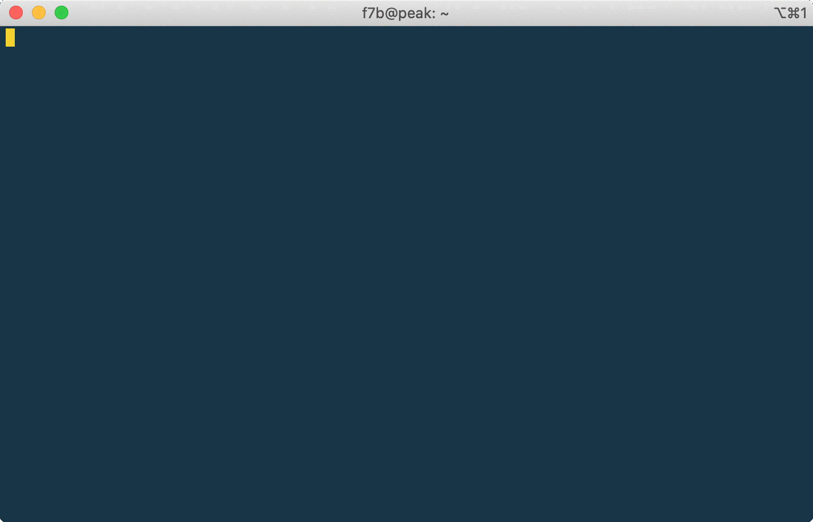

# Parallel tree walks and tools 

This is a Go implementation of parallel tree walk and a suite of file system tools aiming for large-scale and performant profiling tools. Differing from Python-based [pcircle](http://github.com/fwang2/pcircle) and C++ based [fprof](http://github.com/fwang2/fprof), where both rely on MPI for inter-communication to implement cluster wide _work stealing_ and _distributed termination detection_, **pi** is meant to run interactively on a single machine with good scaling properties. 

On OLCF's Summit production file system, a 250 PB, GPFS-based parallel file system, we observed over 200,000 ops/seconds scanning rate, with 128 threads on a single IBM POWER9 node. It should be more than sufficient for regular use. That said, HPC file system is infamous for extreme cases, such a a single shared directory with more 2 to 7 million files. It is difficult to handle this kind of shared directory if PFS doesn't implement distributed directory striping such as [Lustre's DNE2](http://cdn.opensfs.org/wp-content/uploads/2015/04/Scalability-Testing-of-DNE2-in-Lustre-27_Simms_V2.pdf) or GPFS's distributed meta node handling. It remains to be see if this is good enough for a full system scan.

## Install

```
go get -u github.com/fwang2/pi

```

This will be the binary **pi** into your `GOPATH`, by default, it is your `$HOME/go/bin`.

## Usage
```
11:13:37 ▶ pi -h       
pi is a suite of file system tools

Usage:
  pi [command]

Available Commands:
  help        Help about any command
  profile     General file system profiling
  topn        Find top N items of interest

Flags:
  -h, --help      help for pi
      --np int    Number of worker threads (default 8)
  -v, --verbose   verbose output

Use "pi [command] --help" for more information about a command.
```

## Demo



## Naming

I thought about using "pie" as the name, who doesn't like a piece of pie? But, "pi" is one letter short, and that is more important :grin:


